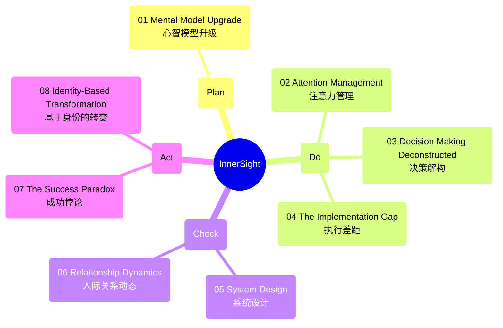

# InnerSight

> "Understanding yourself is the foundation of all other understanding. When you truly know how your own mind works, everything else becomes clearer."

InnerSight is a project dedicated to transforming information into wisdom by focusing on self-understanding and actionable insights. Instead of simply accumulating more knowledge, the goal is to internalize and implement the wisdom that already lies within you.

---

---

## Overview

- **Beyond Accumulation:**  
  Most people will spend decades discovering patterns and insights, but you don't have to. While screenshots and notes can help you remember information, it is the act of implementation that transforms knowledge into true wisdom.

- **Action over Trivia:**  
  The goal isn't to accumulate more knowledge—it's to need less. Wisdom without action is merely trivia. The real transformation happens when you apply what you've learned to your life.

- **Self-Awareness as the Key:**  
  Understanding yourself is the foundation of all other understanding. When you truly grasp how your own mind works, everything else becomes clearer.

## Your Challenge

Don't just passively consume content—engage with it actively. Identify one insight from this project that resonates deeply with you and implement it immediately.

The wisdom is already within you. Take the challenge and start your journey toward actionable self-improvement.

## Getting Started

1. **Reflect:**  
   Meditate on your current thought patterns and the insights shared in this project.

2. **Identify:**  
   Choose one insight that stands out to you—something that has the potential to transform your perspective or habits.

3. **Implement:**  
   Make a plan to apply that insight in your daily life. Remember, small, consistent actions can lead to significant change over time.

4. **Engage:**  
   Share your progress, insights, and questions with the community. Your experience can inspire and help others on their journey.

## Join the Community

If you find value in InnerSight, consider joining our growing community. Share your thoughts, subscribe for updates, and help create a space where wisdom is not just learned but lived. For additional support and deeper engagement, check out our [Patreon](#) page.

## Feedback

Your insights and feedback are invaluable. Let us know your thoughts on what we've shared and how these ideas have influenced your journey. Together, we can foster a community dedicated to meaningful, actionable wisdom.

---

## Attribution

This project is inspired by and based on the insights from the YouTube video “[It took me 35+ years to realize what I'll tell you in 15 minutes](https://www.youtube.com/watch?v=WfE7Cl8qyKA)” by [Productive Peter].

- **Use Excerpts Carefully:**  
  Only short excerpts or summaries that fall under fair use are included, rather than large verbatim scripts from the video.

- **Paraphrase or Summarize:**  
  The content is largely rephrased or summarized to transform it into original work.

- **Check Licensing:**  
  Please refer to the original video description or contact the creator for any specific licensing terms regarding reuse.

- **Link to the Source:**  
  View the original video [here](https://www.youtube.com/watch?v=WfE7Cl8qyKA) for further context and insights.

---

## License

This project is licensed under the terms of the [LICENSE](./LICENSE) file.

---

Thank you for being a part of the InnerSight journey. Let's transform knowledge into wisdom—one insight at a time.
